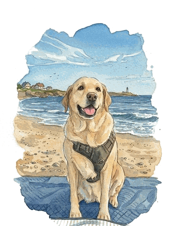

<picture>
<source media="(prefers-color-scheme: dark)" srcset="assets/title-dark.svg">

</picture>

A <strong>Software Engineer</strong> with 5+ years of experience and a <strong>Graduate Student</strong> at SJSU, graduating December 2026.  
Currently working on a distributed datacenter networking software as a Software Development Engineering Intern at <strong>Nokia</strong>.  
Before my masters I was working as a Software Engineer at <strong>Gen Digital</strong> (formerly Norton Lifelock / Symantec) building consumer security products for Windows.

On campus I worked as a <strong>Teaching Assistant</strong> for Software System Design and Database Management System courses, and <strong>Graduate Research Assistant</strong> working on an AI LMS platform. I represented Adobe as a Student Ambassador and hosted and managed creative events and activities for students on campus during my time as the <strong>Treasurer</strong> for the Art &amp; Design Society club.

I have previously worked with: C++, Go, Java, Python, React, TypeScript, Javascript, Node, SQL, MongoDB, AWS

<a href="https://www.linkedin.com/in/shamathmika">LinkedIn</a> &middot; <a href="https://shamathmika.vercel.app/">Portfolio</a>

Show Jack some love while you are here

<!-- PET:START -->

<code>food&nbsp;&nbsp;&nbsp;&nbsp;&nbsp;&nbsp;████████████████████&nbsp;&nbsp;98</code> 
<code>water&nbsp;&nbsp;&nbsp;&nbsp;&nbsp;████████████████████&nbsp;&nbsp;98</code> 
<code>affection&nbsp;████████████████████&nbsp;100</code>

<a href="https://github.com/shamathmika/shamathmika/issues/new?body=Submit+this+issue.+Jack+gets+fed%2C+then+replies+here+and+closes+it.&title=pet%7Cfeed">feed</a>
&nbsp;&nbsp;&middot;&nbsp;&nbsp;
<a href="https://github.com/shamathmika/shamathmika/issues/new?body=Submit+this+issue.+Jack+gets+watered%2C+then+replies+here+and+closes+it.&title=pet%7Cwater">give water</a>
&nbsp;&nbsp;&middot;&nbsp;&nbsp;
<a href="https://github.com/shamathmika/shamathmika/issues/new?body=Submit+this+issue.+Jack+gets+petted%2C+then+replies+here+and+closes+it.&title=pet%7Cpet">pet</a>

last petted by <a href="https://github.com/shamathmika">@shamathmika</a>, 13 minutes ago

4 visits from 1 person

<!-- PET:END -->
