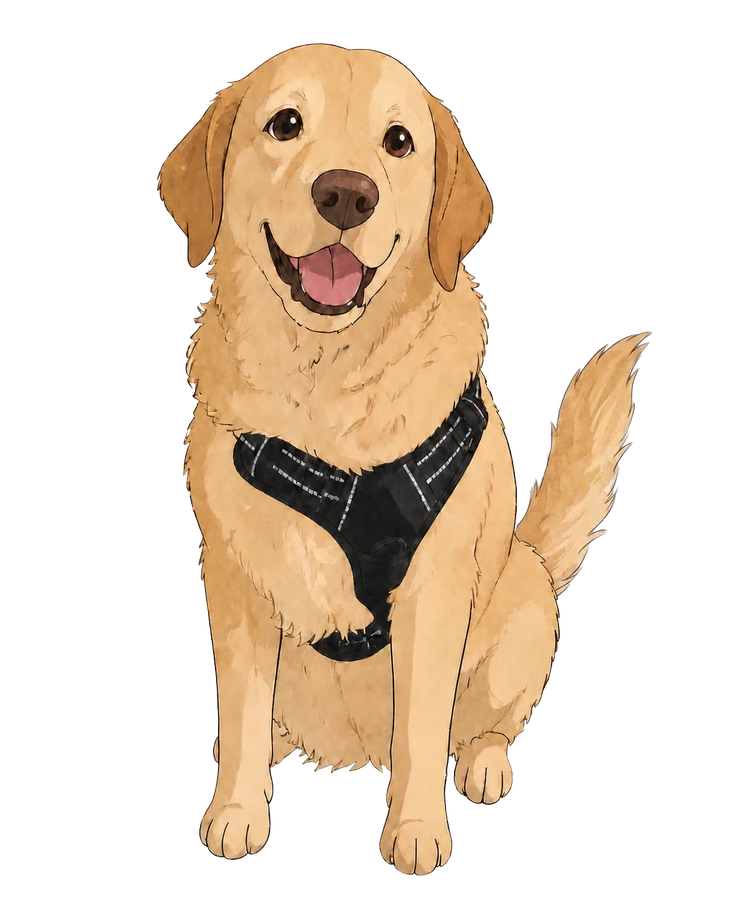

<picture>
<source media="(prefers-color-scheme: dark)" srcset="assets/title-dark.svg">

</picture>

<a href="https://www.linkedin.com/in/shamathmika">LinkedIn</a> &middot; <a href="https://shamathmika.vercel.app/">Portfolio</a>

A <strong>Software Engineer</strong> with 5+ years of experience and a <strong>Graduate Student</strong> at SJSU, graduating December 2026.   
Currently working on a distributed datacenter networking software as a Software Development Engineering Intern at <strong>Nokia</strong>. Before my masters I was working as a Software Engineer at <strong>Gen Digital</strong> (formerly Norton Lifelock / Symantec) building consumer security products for Windows.

On campus I worked as a <strong>Teaching Assistant</strong> for Software System Design and Database Management System courses, and as a <strong>Graduate Research Assistant</strong> working on an AI LMS platform. I represented Adobe as a Student Ambassador and hosted and managed creative events and activities for students on campus during my time as the <strong>Treasurer</strong> for the Art &amp; Design Society club.

<!-- PET:START -->

Say hello to <strong>Jack</strong> while you are here!

Spoil her with 
<a href="https://github.com/shamathmika/shamathmika/issues/new?body=Submit+this+issue+and+Jack+gets+a+treat.+She+replies+here+and+closes+it+herself.+Then+head+back+to+%5Bthe+profile%5D%28https%3A%2F%2Fgithub.com%2Fshamathmika%29+and+refresh+to+see+her+reaction.&title=pet%7Cfeed">treats</a>
/
<a href="https://github.com/shamathmika/shamathmika/issues/new?body=Submit+this+issue+and+Jack+gets+some+water.+She+replies+here+and+closes+it+herself.+Then+head+back+to+%5Bthe+profile%5D%28https%3A%2F%2Fgithub.com%2Fshamathmika%29+and+refresh+to+see+her+reaction.&title=pet%7Cwater">water</a>
/
<a href="https://github.com/shamathmika/shamathmika/issues/new?body=Submit+this+issue+and+Jack+gets+lots+of+pets.+She+replies+here+and+closes+it+herself.+Then+head+back+to+%5Bthe+profile%5D%28https%3A%2F%2Fgithub.com%2Fshamathmika%29+and+refresh+to+see+her+reaction.&title=pet%7Cpet">pets</a>

<strong>Her stats</strong>

<code>food&nbsp;&nbsp;&nbsp;&nbsp;&nbsp;&nbsp;██████████████████░░&nbsp;&nbsp;92</code> 
<code>water&nbsp;&nbsp;&nbsp;&nbsp;&nbsp;███████████████░░░░░&nbsp;&nbsp;77</code> 
<code>affection&nbsp;███████████████████░&nbsp;&nbsp;93</code>

<a href="https://github.com/cheesken">@cheesken</a> gave her a treat, 12 hours ago 15 visits from 4 people

<!-- PET:END -->

